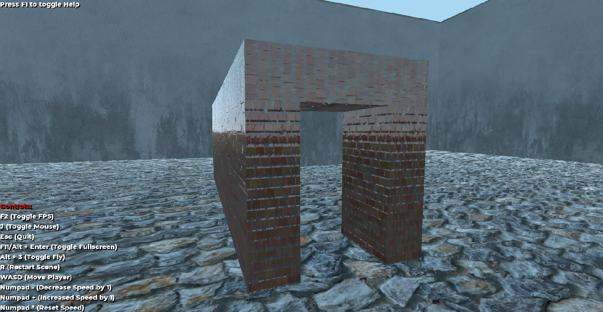

# NonEuclidean-Godot

A Non-Euclidean space in Godot for Windows, Linux and Mac OSX,
written in GDScript.
To see what this is about, check this out: https://www.youtube.com/watch?v=xQ1b8cmUa8w .
Obviously, this is a fake Non-Euclidean space.
Godot isn't capable of Non-Euclidean spaces yet.

## Controls

- **F1** (Toggle Help)
- **F2** (Toggle FPS Counter)
- **J** (Toggle Mouse)
- **Esc** (Quit)
- **F11** or **Alt + Enter** (Toggle Fullscreen)
- **Alt + 3** (Toggle Fly)
- **R** (Restart Scene)
- **WASD** (Move Player)
- **Numpad -** (Decrease Speed by 1)
- **Numpad +** (Increase Speed by 1)
- **Numpad Multiply** (Reset Speed)
- **Mouse** (Look around)

## Features

- [x] Fake Non-Euclidean space
- [x] Textures for low-end computers (GLES2)
- [ ] Stop rendering other viewports when player behind a wall (performance wise)
- [ ] Seamless player teleportation
- [ ] Be able teleport any body through the portal seamlessly
- [ ] Actual Non-Euclidean space (would most probably never happen, but who knows ¯\_(ツ)_/¯)

## Compiled binaries

If you want to play the game on Windows, Linux or Mac OSX, I have already compiled them in the [bin GLES2](Non-Euclidean-3D-GLES2-Low-End/bin) and [bin GLES3](Non-Euclidean-3D-GLES3/bin) folders.

## How it works

### Rendering

Each side of the tunnel has a camera attached to it, mapped to a `ViewportTexture`
on each MeshInstance of the sides of the tunnel. These cameras move based on the player position
so that the angles look realistic (3D).

# Credits

Big, very, seriously, very big huge thanks to @io12 for sharing his project on github (https://github.com/io12/godot-portal-demo) so I
could use his code for proper camera angles! Also, thanks @HackerPoet for inspiring me to do this :D (https://github.com/HackerPoet/NonEuclidean)
